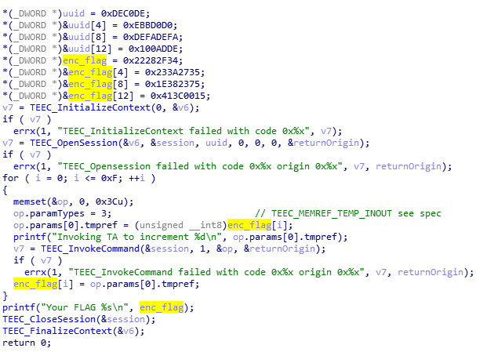

# PWN
The picture from the hint shows an interpreter, very similar to sh. Trying send sh by first message and got it.   
Without a hint, try the overflow, it doesn't work, try the format strings, it doesn't work, so most likely there is some kind of handler on the server, we try various commands in the shell calling style.
  

# Hello world
First challenge in trustzone. Open task1 in ida, check strings window and see strings like `TEEC_FinalizeContext`,`TEEC_InvokeCommand`,`TEEC_CloseSession`. Google it and got [client spetsification](http://citeseerx.ist.psu.edu/viewdoc/download;jsessionid=2C3A19C13215CE2ACB0A0069B09B5039?doi=10.1.1.183.2049&rep=rep1&type=pdf) [GlobalPlatform API tee](https://globalplatform.org/wp-content/uploads/2018/06/GPD_TEE_Internal_Core_API_Specification_v1.1.2.50_PublicReview.pdf) specification with prototypes of these functions.This will help a lot with the reverse of all tasks.  
```C
TEEC_Result TEEC_InvokeCommand(
 TEEC_Session* session,
 uint32_t commandID,
 TEEC_Operation* operation,
 uint32_t* returnOrigin)
```
in main function rename vars and got this, TEEC_Operation is struct like this
```C
typedef struct
{
 uint32_t started;
 uint32_t paramTypes;
 TEEC_Parameter params[4];
 uint32_t imp;
} TEEC_Operation;
typedef union
{
 TEEC_TempMemoryReference tmpref;
 TEEC_MemoryReference memref;
} TEEC_Parameter;
```  
In our challenge 32bit binary hence referense and uint32_t equal add in ida.
  
client invoking command with id 1,remember it and open TA.  
Trying open TA in ida ond see that is opening as blob. Open in hex editor and seen ELF signature, cut first 0x148 bytes(it's just sign), reopen in IDA and it's work.
On start function we see one call. Check it and found nothing
```asm
BLX sub_CF24
NOP
```
check with file 
```bash
$ file 00dec0de-d0d0-0ebb-fade-fadedead0001.ta
00dec0de-d0d0-0ebb-fade-fadedead0001.ta: ELF 32-bit LSB shared object, ARM, EABI5 version 1 (SYSV), dynamically linked, stripped
```
  
check strings and found some interesting `Got value: %u from NW`, Got value from normal world,maybe is one of handlers,check referene and found function `sub_114` witch called from `sub_1E4` when second arg is 1(Hmmm)
```C
signed int __fastcall sub_1E4(int a1, int a2, int a3, _DWORD *a4)
{
  signed int v4; // r3

  if ( a2 == 1 )
    v4 = dec_value(a3, a4);
  else
    v4 = 0xFFFF0006;
  return v4;
}
```  
And....
```C
signed int __fastcall dec_value(int a1, _DWORD *a2)
{
  int v7; // [sp+10h] [bp+0h]
  int v8; // [sp+14h] [bp+4h]

  v8 = 3;
  v7 = 0;
  log_35E((int)"dec_value", 0x4D, 3, 1, "has been called");
  if ( a1 != 3 )
    return -65530;
  log_35E((int)"dec_value", 81, 3, 1, "Got value: %u from NW", *a2);
  getprop_1F96(-1, (int)"unictf.2020.data.key", (int)&v7);
  *a2 ^= v7;
  log_35E((int)"dec_value", 84, 3, 1, "Return value is: %u", *a2);
  return 0;
}
```  
Just xoring with some value,brutefroce this value or try find `"unictf.2020.data.key"` in binary  
```C
int __fastcall getprop_1F96(int a1, int prop, int buf)
{
  int v3; // lr
  int v5; // [sp+1Ch] [bp+Ch]
  int v6; // [sp+20h] [bp+10h]
  int v7; // [sp+24h] [bp+14h]
  int v8; // [sp+2Ch] [bp+1Ch]

  v8 = v3;
  v5 = 4;
  if ( buf )
  {
    v6 = 1;
    v7 = sub_1B26((int *)a1, prop, &v6, buf, (int)&v5);
    if ( v6 != 1 )
      v7 = 0xFFFF0005;
  }
  else
  {
    v7 = 0xFFFF0006;
  }
  if...
  return v7;
}
int __fastcall sub_1B26(int *a1, int a2, _DWORD *a3, int a4, int a5)
{
  int v9; // r0
  int v15; // [sp+20h] [bp+4h]
  int v16; // [sp+24h] [bp+8h]
  unsigned int v17; // [sp+28h] [bp+Ch]
  int v18; // [sp+2Ch] [bp+10h]
  unsigned int v19; // [sp+30h] [bp+14h]
  int *v20; // [sp+34h] [bp+18h]
  unsigned int i; // [sp+38h] [bp+1Ch]
  int v22; // [sp+3Ch] [bp+20h]

  if...
  v22 = sub_1964((int)a1, &v18, &v17);
  if...
  return v22;
}
signed int __fastcall sub_1964(int a1, _DWORD *a2, _DWORD *a3)
{
  switch ( a1 )
  {
    case (int)0xFFFFFFFF:
      *a2 = &off_10238;
      *a3 = 9;
      return 0;
    case (int)0xFFFFFFFE:
      *a2 = 0;
      *a3 = 0;
      return 0;
    case (int)0xFFFFFFFD:
      *a2 = &off_102A4;
      *a3 = 3;
      return 0;
  }
  return -65528;
}
```
And got offset with props defined, props table have struct like this
```C
struct prop{
    char* name;
    uint32_t type;
    char* value;
}
```
We got xor key! Just xor bytes from client and get flag `unictf{b4by_TA}`
```C
.data:00010298                 DCD aUnictf2020Data_1   ; "unictf.2020.data.key"
.data:0001029C                 DCD 1
.data:000102A0                 DCD unk_D990
...
.rodata:0000D990 unk_D990        DCB 0x41 ; A
```

```python
flag = [0x34,0x2f,0x28,0x22,0x35,0x27,0x3a,0x23,0x75,0x23,0x38,0x1e,0x15,0x00,0x3c,0x41]
for i in flag:
    printf(chr(i^0x41),end="")
```

# File encryption  

The next task is a little harder than the previous. Open task2 in IDA and see that file not stripped, cool!  
```C
int __cdecl main(int argc, const char **argv, const char **envp)
{
  const char *v3; // r3
  char *v4; // r2
  int v7; // r0
  int v8; // r1
  _WORD *v9; // r4
  const char *v10; // r4
  int v11; // r7
  int v12; // r0
  int v13; // r6
  size_t size; // r7
  void *key_der; // r4
  size_t v16; // r0
  int mode; // r3
  int file; // [sp+0h] [bp-40h]
  char ses; // [sp+4h] [bp-3Ch]
  char v21; // [sp+14h] [bp-2Ch]

  v3 = "SUPERSECRETSTRING";
  v4 = &v21;
  do...                                         // cp v3 to v21
  *v9 = *(_WORD *)v3;
  if ( argc != 3
    || (v10 = argv[1], v11 = strcmp(argv[1], "decrypt"), v12 = strcmp(v10, "encrypt"), v13 = v12, v11) && v12 )
  {
    puts("Usage task2 <encrypt/decrypt> <name file>");
    exit(0);
  }
  size = read_file(&file, (int)argv[2]);
  prepare_tee_session(&ses);
  key_der = malloc(0x20u);
  memset(key_der, 173, 0x20u);
  v16 = strlen(&v21);
  memcpy(key_der, &v21, v16);
  mode = v13;
  if ( v13 )
    mode = 1;
  derive_key((int)&ses, (int)key_der, 0x20, mode);
  finalize_op(&ses, &file, size);
  if ( v13 )
    printf("Your FLAG %s\n", "Hello_world");
  save_file((const void **)&file, (int)argv[2], size);
  terminate_tee_session(&ses);
  free(key_der);
  return 0;
}
```
We see that there is a certain derive of a key and the finalize op of the decryption or encryption operation. The key is derive on the basis of the SUPERSECRETSTRING string padded to length with 32 bytes `0xad`. In func `read_file` seen that file will padding with zero bytes to length multiple 16. When a file is encrypted / decrypted, it is saved to the same file. Ok, lets check func `derive_key` and `finalize_op`.
```C
nt __fastcall derive_key(int *ses, int key, int key_len, int mode)
{
  int result; // r0
  int v9; // [sp+0h] [bp-58h]
  TEEC_Operation op; // [sp+4h] [bp-54h]

  memset(&op, 0, 0x3Cu);
  op.paramTypes = 21;
  op.params[0].tmpref = key;
  op.params[1].tmpref = key_len;
  op.params[3].tmpref = mode;
  result = TEEC_InvokeCommand(ses + 2, 1, &op, &v9);
  if ( result )
    errx(1, "TEEC_InvokeCommand failed with code 0x%x origin 0x%x", result, v9);
  return result;
}
```
```C
void __fastcall finalize_op(int ses, void **file, size_t size)
{
  void *out_buf; // r6
  int v7; // r2
  int v8; // [sp+0h] [bp-58h]
  TEEC_Operation s; // [sp+4h] [bp-54h]

  memset(&s, 0, 0x3Cu);
  out_buf = malloc(size);
  s.paramTypes = 101;
  s.params[0].tmpref = (uint32_t)*file;
  s.params[1].tmpref = size;
  s.params[3].tmpref = (uint32_t)out_buf;
  s.imp = size;
  v7 = TEEC_InvokeCommand(ses + 8, 2, &s, &v8);
  if ( v7 )
    errx(1, "TEEC_InvokeCommand failed with code 0x%x origin 0x%x", v7, v8);
  free(*file);
  *file = out_buf;
}
```
`derive_key` sends key and mode (dec / enc),` finalize_op` sends input data and output buffer to TA. There is nothing to watch now, close client and open TA same way as in first task.Find `TA_InvokeCommandEntryPoint` function by xrefs to same string. Found 2 supported command is finalize_op, and derive_key named by the same names in client. 
```C
int __fastcall TA_InvokeCommandEntryPoint(int sessionContext, int commandID, int paramTypes, int params)
{
  if ( commandID == 1 )
    return derive_key((_DWORD *)sessionContext, paramTypes, (int *)params);
  if ( commandID == 2 )
    return finalize_op(sessionContext, paramTypes, params);
  sub_5DA("TA_InvokeCommandEntryPoint", 213, 1, 1, "Command ID 0x%x is not supported", commandID, params, paramTypes);
  return 0xFFFF000A;
}
signed int __fastcall derive_key(_DWORD *sessionContext, int paramTypes, TEEC_Parameter *params)
{
  int xor_key; // [sp+18h] [bp+8h]
  int v8; // [sp+1Ch] [bp+Ch]
  int size; // [sp+28h] [bp+18h]
  int key; // [sp+2Ch] [bp+1Ch]
  int v12; // [sp+34h] [bp+24h]
  int i; // [sp+38h] [bp+28h]
  int v14; // [sp+3Ch] [bp+2Ch]

  v12 = 21;
  if ( paramTypes != 21 )
    return 0xFFFF0006;
  *sessionContext = params[2].tmpref;
  if...
  v14 = allocate_operation(sessionContext + 1, 0x10000110u, *sessionContext, 0x100u);// TEE_ALG_AES_CBC_NOPAD
  if ( v14 )
  {
    sub_5DA("derive_key", 44, 1, 1, "Failed to allocate operation");
    sessionContext[1] = 0;
  }
  else
  {
    key = params->tmpref;
    size = params[1].tmpref;
    getprop(0xFFFFFFFF, "unictf.2020.data.key", &xor_key);// 0x41
    for ( i = 0; i <= 15; ++i )
      *(_BYTE *)(i + key) ^= (_BYTE)i + (_BYTE)xor_key;
    v14 = allocate_transient_object(0xA0000010, 256, sessionContext + 2);// TEE_TYPE_AES
    if ( v14 )
    {
      sub_5DA("derive_key", 63, 1, 1, "Failed to allocate transient object");
      sessionContext[2] = 0;
    }
    else
    {
      sub_1140E((int)&v8, 0xC0000000, key, size);// secret value
      v14 = TEE_PopulateTransientObject(sessionContext[2], &v8, 1);
      if ( !v14 )
        return 0;
      sub_5DA("derive_key", 72, 1, 1, "TEE_PopulateTransientObject failed, %x", v14);
    }
  }
  if...
  sessionContext[1] = 0;
  if...
  sessionContext[2] = 0;
  return v14;
}
```
  
Okey general key derive is: 
```python
key = list(b"SUPERSECRETSTRING"+b"\xad"*(32-17))
for i in range(16):
    key[i]^=(0x41+i)
```
check finalyze func to get iv
```C
signed int __fastcall finalize_op(int *session, int paramtypes, TEEC_Parameter *params)
{
  int v6; // r3
  char iv[16]; // [sp+1Ch] [bp+8h]
  int v10; // [sp+2Ch] [bp+18h]
  int v12; // [sp+34h] [bp+20h]

  v12 = 101;
  if ( paramtypes != 101 )
    return 0xFFFF0006;
  v10 = TEE_SetOperationKey(session[1], session[2]);
  if ( v10 )
  {
    sub_5DA("finalize_op", 107, 1, 1, "TEE_SetOperationKey failed %x", v10);
    if ( session[1] )
      sub_340A(session[1]);
    session[1] = 0;
    if ( session[2] )
      sub_111F6(session[2]);
    session[2] = 0;
    v6 = v10;
  }
  else
  {
    memset((int)iv, 0, 0x10);
    sub_3CBA(session[1], iv, 0x10);
    v6 = sub_4062(session[1], params->tmpref, params[1].tmpref, params[2].tmpref, &params[3].tmpref);
  }
  return v6;
}
```
Now try decrypt with this key flag  
```Python
from Crypto.Cipher import AES

flag=open("flag.enc","rb").read()
key = list(b"SUPERSECRETSTRING"+b"\xad"*(32-17))
for i in range(16):
    key[i]^=(0x41+i)
key_b=b""
for i in key:
    key_b+=i.to_bytes(1,"little")
cipher = AES.new(key_b, AES.MODE_CBC, b"\x00"*16)
cipher.decrypt(flag)
>>> b'unictf{A4@1n_F1l3_ENCRYPTION}\n\x00\x00'
```
Decrypt private.enc
```python
private = open("Private.enc","rb").read()
cipher = AES.new(key_b, AES.MODE_CBC, b"\x00"*16)
private = cipher.decrypt(private)
with open("private.der","wb") as f:
    f.write(private)
```
And lets try to solve next task

# Client Handler
Nobody solved this task. no writeup(because will just take up too much space, and solution way is same as the previous tasks)))
Have some written solution but it's on C(or python)